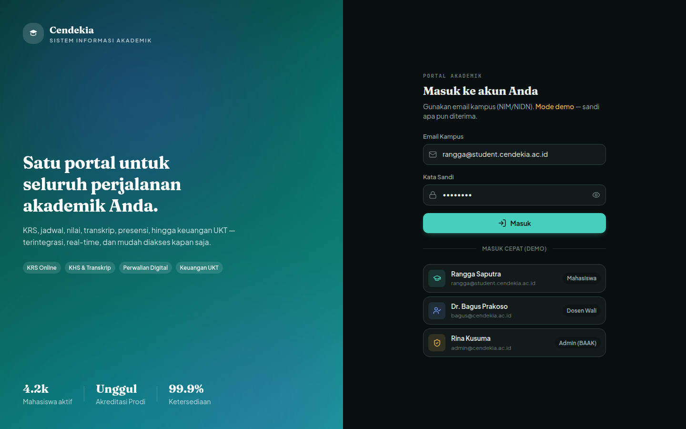
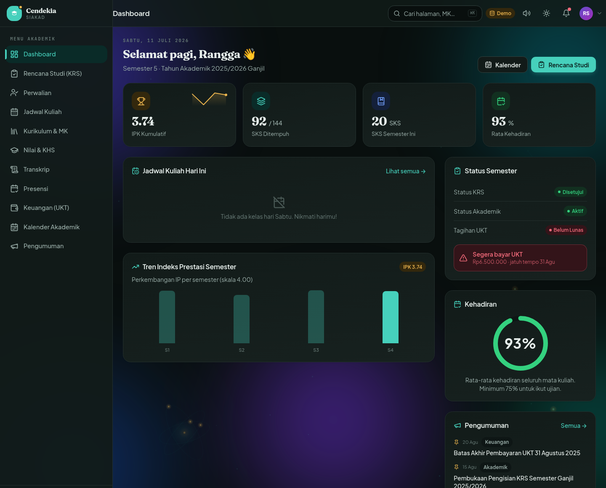
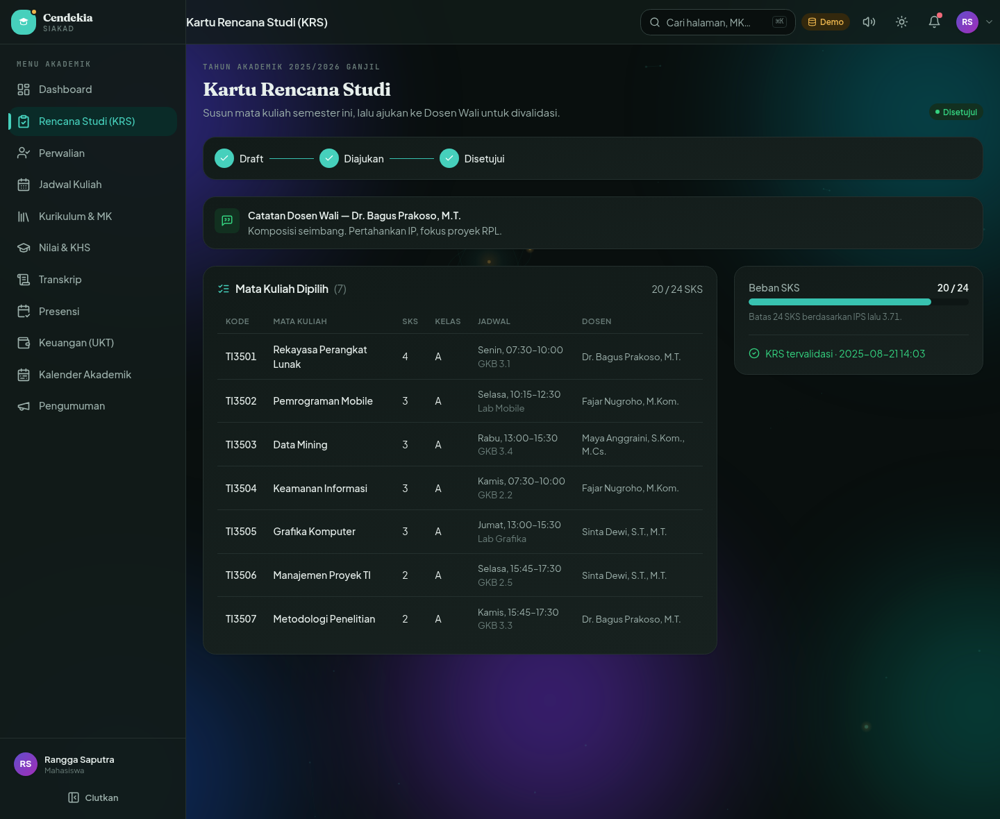
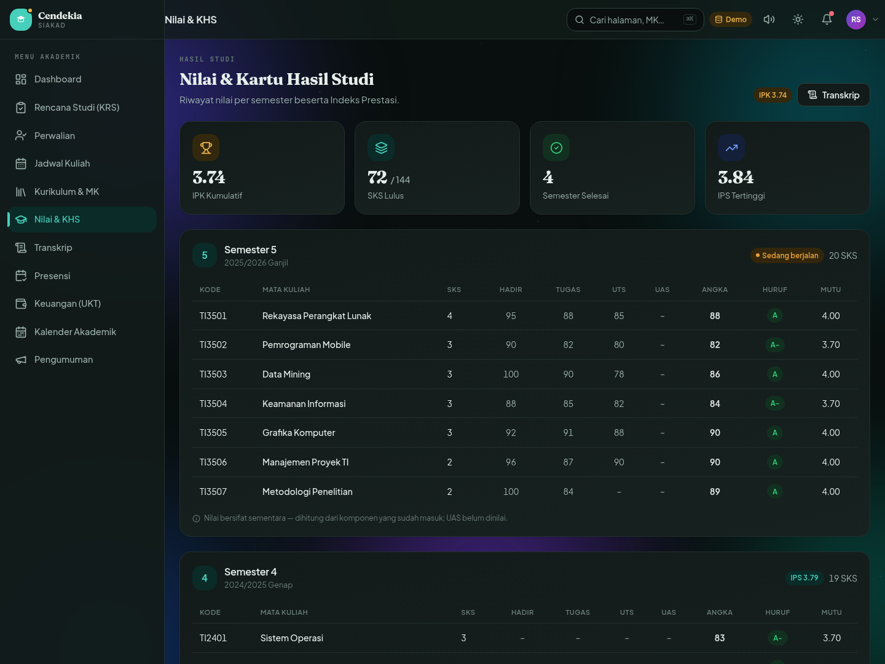
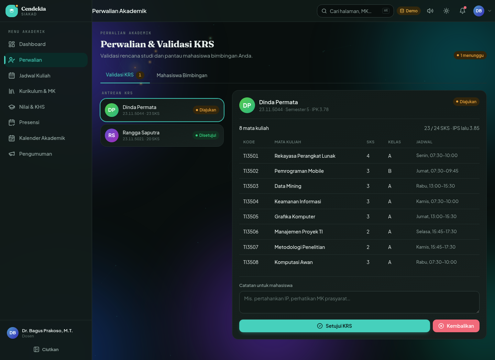
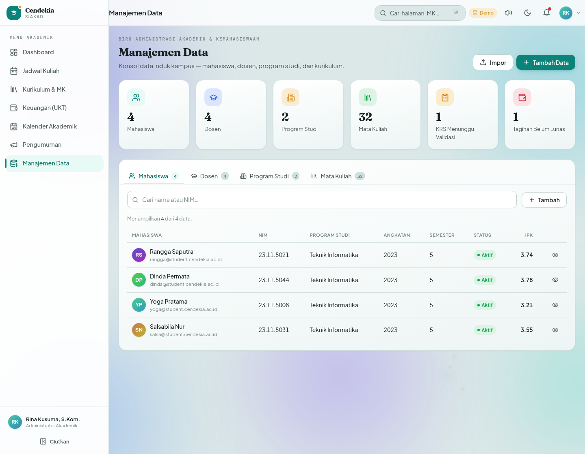

<div align="center">



# 🎓 Cendekia SIAKAD

### Sistem Informasi Akademik Perguruan Tinggi — Modern, Responsif, Installable

[](https://siakad.learningsystem.my.id)


</div>

---

## 📖 Tentang

**Cendekia SIAKAD** adalah Sistem Informasi Akademik (SIAKAD) untuk perguruan tinggi yang menyatukan seluruh perjalanan akademik mahasiswa — **KRS, jadwal, nilai, transkrip, presensi, hingga keuangan UKT** — dalam satu portal yang cepat, modern, dan bisa dipasang sebagai aplikasi (PWA) di HP maupun laptop.

Dibangun dengan tiga peran pengguna (**Mahasiswa**, **Dosen/Dosen Wali**, **Admin/BAAK**), setiap alur mengikuti praktik SIAKAD nyata: pengisian KRS dengan validasi batas SKS berbasis IPS & cek prasyarat, persetujuan KRS oleh dosen wali, input komponen nilai dengan huruf mutu otomatis, hingga rekap kehadiran dan tagihan UKT.

> 🌐 **Live:** [siakad.learningsystem.my.id](https://siakad.learningsystem.my.id)

---

## ✨ Fitur Utama

- 🔐 **Multi-peran** — Mahasiswa, Dosen (termasuk Dosen Wali), dan Admin/BAAK dengan menu & dashboard berbeda.
- 📝 **KRS (Kartu Rencana Studi)** — ambil/hapus kelas, validasi batas SKS berbasis IPS, cek mata kuliah prasyarat, deteksi bentrok jadwal, alur *Draft → Diajukan → Disetujui/Ditolak*.
- 🧑‍🏫 **Perwalian Digital** — dosen wali memvalidasi KRS bimbingan (setujui/kembalikan + catatan); mahasiswa memantau pembimbing & status.
- 🗓️ **Jadwal Kuliah** — tabel mingguan (timetable) & tampilan daftar.
- 📚 **Kurikulum & Mata Kuliah** — katalog per semester, prasyarat, status kelulusan MK.
- 💯 **Nilai & KHS** — dosen input komponen (kehadiran/tugas/UTS/UAS → huruf mutu otomatis); mahasiswa melihat KHS + IPS per semester.
- 📜 **Transkrip Akademik** — transkrip resmi + IPK + predikat kelulusan, siap cetak/PDF.
- ✅ **Presensi** — rekap kehadiran mahasiswa & per-kelas untuk dosen.
- 💳 **Keuangan (UKT)** — tagihan, Virtual Account, riwayat & simulasi pembayaran.
- 📅 **Kalender Akademik** — grid bulanan + agenda berwarna per kategori.
- 🗂️ **Manajemen Data (Admin)** — konsol data mahasiswa, dosen, prodi, mata kuliah.
- ⌘ **Pencarian Global (⌘K / Ctrl+K)** — lompat cepat ke halaman, mata kuliah, atau mahasiswa.
- 🔔 **Notifikasi Kontekstual** — tagihan, status KRS, dan kehadiran otomatis dari data.
- 📱 **Progressive Web App** — installable di **iOS, Android, & Desktop**, mode standalone, dukungan offline.
- 🌗 **Mode Gelap & Terang** — desain teal institusional yang konsisten di kedua tema.

---

## 🛠️ Tech Stack

| Kategori | Teknologi |
|----------|-----------|
| Framework | **Vue 3** (Composition API, `<script setup>`) |
| Build Tool | **Vite 7** |
| Styling | **Tailwind CSS v4** (design tokens via `@theme`) |
| State | **Pinia** |
| Routing | **Vue Router 4** |
| Ikon | **lucide-vue-next** |
| Font | Plus Jakarta Sans · Fraunces · JetBrains Mono (bundled lokal) |
| PWA | Web App Manifest + Service Worker (offline app-shell) |
| Deploy | **Cloudflare Pages** |

---

## 🚀 Instalasi & Menjalankan

```bash
# 1. Clone repositori
git clone https://github.com/Kstriabintang/cendekia-siakad.git
cd cendekia-siakad

# 2. Install dependency
npm install

# 3. Jalankan mode development
npm run dev          # buka http://localhost:5173

# 4. Build untuk produksi
npm run build        # hasil di folder dist/
npm run preview      # pratinjau hasil build (PWA aktif penuh)
```

> **Catatan data:** aplikasi berjalan penuh dengan *mock backend* (in-memory + `localStorage`) tanpa konfigurasi. Untuk menyambungkan **Supabase**, isi `.env` (lihat `.env.example`) dan buat `src/services/supabaseBackend.js` dengan nama method yang sama — tanpa mengubah komponen.

---

## 👤 Akun Demo

Mode demo — **sandi apa pun diterima**, dan tersedia tombol **masuk cepat** di halaman login.

| Role | Username | Password |
|------|----------|----------|
| Admin / BAAK | `admin@cendekia.ac.id` | `demo1234` |
| Dosen (Wali) | `bagus@cendekia.ac.id` | `demo1234` |
| Mahasiswa | `rangga@student.cendekia.ac.id` | `demo1234` |

---

## 📸 Tampilan

### Halaman Masuk


### Dashboard Mahasiswa


### Kartu Rencana Studi (KRS)


### Nilai & Kartu Hasil Studi (KHS)


### Perwalian & Validasi KRS (Dosen)


### Manajemen Data (Admin)


---

## 📲 Pasang sebagai Aplikasi (PWA)

- **Android / Desktop (Chrome/Edge):** klik banner **"Instal"** atau menu ⋮ → *Install app*.
- **iOS (Safari):** tombol **Bagikan** → **Tambah ke Layar Utama**.

Setelah dipasang, aplikasi berjalan **standalone** (tanpa address bar), memiliki ikon sendiri, dan mendukung penggunaan **offline** untuk kerangka aplikasi.

---

## 📄 Lisensi

Dirilis di bawah lisensi **MIT** — lihat berkas [LICENSE](LICENSE).

<div align="center">

Dikembangkan oleh **Ksatria Bintang Samudra** · © 2026

</div>
